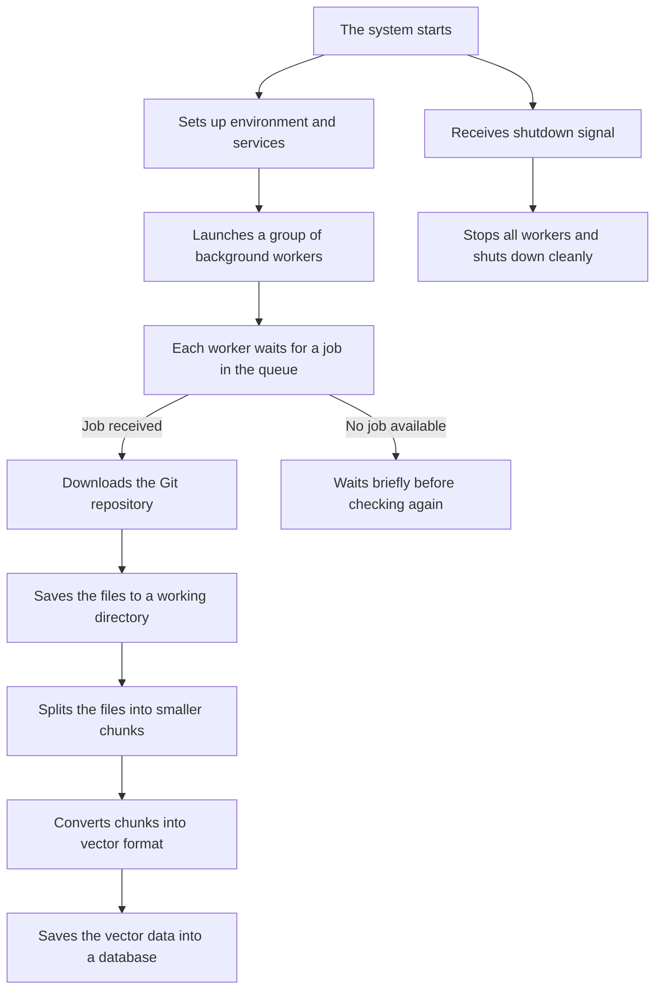

# DevDox Ai Context
A backend API service for the DevDox Ai Context,built with FastAPI and Supabase, its a management service for code repositories

---

## 📘 Table of Contents

- [📘 Project Overview](#-project-overview)
- [📘 System Architecture & Workflow](#-system-architecture--workflow)
- [📘 Project Structure](#-project-structure)
- [📘 Prerequisites & Supabase Queue Setup](#-prerequisites--supabase-queue-setup)
- [📘 Getting Started](#-getting-started)
- [📘 Environment Variables](#-environment-variables)

---

## 📘 Project Overview

This project is a backend service built to support a **Retrieval-Augmented Generation (RAG)** system by processing Git repositories into structured, searchable vector data.

It listens to a task queue for new jobs. When triggered, it clones the specified repository, breaks its contents into smaller chunks, and converts them into vector embeddings, making large codebases easy to search, explore, or use as live AI knowledge sources.

This system handles the heavy lifting behind smart code search, AI documentation assistants, and LLM context pipelines.

---

## 📘 System Architecture & Workflow

### 📄 Microservices Architecture
DevDox AI Portal API is built with:

- **FastAPI**: Python web framework for API endpoints with automatic OpenAPI documentation
- **Supabase**: Backend-as-a-Service for data storage, accessed via REST API
- **SonarCloud**: Code quality scanning tool

The API service is part of a larger system:

| Repository           | Jira Project Key | Description                            |
|----------------------|------------------|----------------------------------------|
| devdox-ai            | DEV              | Main documentation project and roadmap |
| devdox-ai-agent      | DV               | Core AI agent component                |
| devdox-ai-context    | DAC              | Context building service               |
| devdox-ai-portal     | DAP              | Frontend portal                        |
| devdox-ai-portal-api | DAPA             | Backend portal API (this repository)   |

---

### 📄 DevDox-ai-context Workflow Diagram

---
### 📄 How the DevDox-ai-context System Works

When you run the project, it initializes the environment and starts a group of background workers. These workers **run continuously** and wait for tasks to appear in the queue.

Each task includes the URL of a Git repository to process. Once a job is picked up:

1. The repository is **downloaded and stored locally**
2. Its files are **split into smaller text chunks**
3. The chunks are **converted into vector embeddings**
4. These embeddings are **saved to a vector database** for future semantic search or retrieval

If no job is available, the worker simply waits and retries. On shutdown, the system stops all workers and cleans up resources.

This design allows the system to scale easily and serve as a backend for AI tools that require real-time understanding of code.

---

## 📘 Project Structure

The folders below are arranged by importance and logical flow, starting with the entry point and core logic.

```
.
├── app/                             # Main application codebase
│
│   ├── main.py                      # App entry point starts everything
│   ├── health.py                    # Liveness/readiness probe for monitoring
│
│   ├── handlers/                    
│   │   ├── message_handler.py       # Handle repository processing message
│   │   ├── queue_worker.py          # The queue worker that performs the ingestion operations
│   │   └── utils/                   
│   │       └── constants.py         # Contains all the string messages
│   │       └── git_managers.py      # Contains all the common gitlab and github API operations
│   │       └── repo_fetcher.py      # Contains the logic that handles whether we are dealing with a github or gitlab repo
│
│   ├── services/                    
│   │   └── auth_service.py          # Contains the authentication logic
│   │   └── processing_service.py    # Core logic: clone, chunk, vectorize
│
│   ├── infrastructure/             # Queue + external systems integration
│   │   ├── queues/                 
│   │       └── supabase_queue.py   # Contains the repository that handles the supabase queue operations
│   │   ├── database/               
│   │       └── repositories.py     # Contains the repository layer between ORM models and application 
│   │   └── externalApis/           
│   │       └── git_clients.py      # Manages Git clients integrations  
│
│   ├── schemas/                      # Pydantic schemas for job payloads/results
│   │   └── ...
│
│   ├── core/                        
│   │   ├── config.py                # Contains the configurations for the project
│   │   ├── container.py             # Contains dependency_injector containers
│   │   └── exceptions/              # Contains the global exception handlers
│
│   ├── repos/                       # Temporary storage for cloned repositories
│
├── tests/                           # Unit & integration tests
│   └── ...
│
├── .env.example                     # Environment variable template
├── Dockerfile                       # Docker container configuration
├── pyproject.toml                   # Standardized configuration file that defines a Python project
├── LICENSE
└── README.md                        
```

---

## 📘 Prerequisites & Supabase Queue Setup

Before running the service, make sure the following prerequisites are met:

---

### 📄 Required Python Version

This project requires **Python 3.12**.

Make sure you have Python 3.12 installed and selected in your virtual environment:

```bash
python --version
# Should return: Python 3.12.x
```

---

### 📄 Supabase Configuration

Supabase powers both the PostgreSQL database and the message queue system (via `pgmq`) in this microservice.  
The queue is a critical component, orchestrating async job ingestion, processing, and coordination.  
Refer to the [DevDox Supabase Integration Guide](https://github.com/montymobile1/devdox-ai/blob/main/DEVDOX_SUPABASE_INTEGRATION_GUIDE.md) for full implementation and configuration details.

---

### 📄 Expected Job Format (JSON Payload)

The worker expects incoming jobs to look like this:

```json
{
  "payload": {
    "context_id": "123",
    "branch": "main",
    "config": {},
    "repo_id": "1012348217",
    "user_id": "user_2xioBPMzrTczyKDABvynLeToHst",
    "priority": 1,
    "git_token": "fd767782-de3a-4e5f-8a95-9d411531436c",
    "git_provider": "github",
    "relative_path": "montymobile1/devdox-ai-encryption"
  },
  "job_type": "analyze"
}
```

---

### 📄 Field Descriptions

| Field           | Type     | Description                                                      |
|-----------------|----------|------------------------------------------------------------------|
| `job_type`      | `str`    | Type of job: `"analyze"` or `"process"` (required by the worker) |
| `context_id`    | `str`    | A unique ID for the chunking/vectorization context               |
| `branch`        | `str`    | The Git branch to clone (e.g., `main`)                           |
| `config`        | `object` | Optional configuration override (can be empty `{}`)              |
| `repo_id`       | `str`    | GitHub/GitLab repository ID (numeric)                            |
| `user_id`       | `str`    | ID of the authenticated user (e.g., from Clerk auth)             |
| `priority`      | `int`    | Optional priority for job ordering                               |
| `git_token`     | `str`    | Internal Git token ID from your `git_label` database table       |
| `git_provider`  | `str`    | One of: `"github"` or `"gitlab"`                                 |
| `relative_path` | `str`    | Git repo path (e.g., `org-name/repo-name`)                       |

---

### 📄 Pro Tip (for testing)

You can manually insert jobs into your Supabase queue table for testing purposes, or set up a simple job producer using Python or PostgREST.

---

## 📘 Getting Started

Follow these steps to get the project running on your local machine.

---

### 1. Clone the Repository

```bash
git clone https://github.com/your-org/devdox-ai-context.git
cd devdox-ai-context
```

---

### 2. Create a Virtual Environment

```bash
python -m venv .venv
source .venv/bin/activate   # On Windows: .venv\Scripts\activate
```

---

### 3. Install the Project (with Dev Tools)

```bash
pip install .[dev]
```

This installs the project as a package, along with tools used for development and testing.

---

### 4. Copy and Edit Environment File

```bash
cp .env.example .env
```

Then open `.env` in your editor and fill in the required values (queue URLs, database paths, tokens, etc.).

We’ll explain the variables below.

---

### 5. Run the Application

```bash
python main.py
```

This will start the system and launch the background workers.

---

## 📘 Environment Variables

Below are the key environment variables used by the system. Most have sensible defaults, but a few are **required** to get the service running.

#### 📄 Notes 

- Refer to the [DevDox Supabase Integration Guide](https://github.com/montymobile1/devdox-ai/blob/main/DEVDOX_SUPABASE_INTEGRATION_GUIDE.md) to learn how to extract the configuration details for `Supabase Property`

#### 📄 Required (minimum configuration)

These must be set in your `.env` file before running the app:

| Variable Name       | Type                | Description                                                                                                                                                              |
|---------------------|---------------------|--------------------------------------------------------------------------------------------------------------------------------------------------------------------------|
| `SUPABASE_URL`      | `Supabase Property` | URL of your Supabase instance                                                                                                                                            |
| `SUPABASE_KEY`      | `Supabase Property` | Supabase service key (for API access)                                                                                                                                    |
| `SUPABASE_HOST`     | `Supabase Property` | PostgreSQL host (used if REST API is off)                                                                                                                                |
| `SUPABASE_USER`     | `Supabase Property` | PostgreSQL username                                                                                                                                                      |
| `SUPABASE_PASSWORD` | `Supabase Property` | PostgreSQL password                                                                                                                                                      |
| `SUPABASE_PORT`     | `Supabase Property` | PostgreSQL port (usually 5432)                                                                                                                                           |
| `SUPABASE_DB_NAME`  | `Supabase Property` | PostgreSQL database name                                                                                                                                                 |
| `SUPABASE_REST_API` | `DevDox Property`   | tells the app whether to auto-configure database access using the Supabase URL and key (True), or use raw separate PostgreSQL connection info provided manually (False). |
| `SECRET_KEY`        | `DevDox Property`   | App secret key (min 32 characters)                                                                                                                                       |
| `TOGETHER_API_KEY`  | `Together Property` | API key for Together AI embedding service                                                                                                                                |
| `EMBEDDING_MODEL`   | `Together Property` | Name of the embedding model to use                                                                                                                                       |
| `IS_PRODUCTION`     | `DevDox Property`   | Marks app as running in production                                                                                                                                       |
---

#### 📄 Optional (has default values)

These can be customized as needed, but have defaults:

| Variable Name                    | Type              | Description                                |
|----------------------------------|-------------------|--------------------------------------------|
| `WORKER_CONCURRENCY`             | `DevDox Property` | Number of concurrent workers               |
| `QUEUE_BATCH_SIZE`               | `DevDox Property` | How many jobs to fetch from the queue      |
| `QUEUE_POLLING_INTERVAL_SECONDS` | `DevDox Property` | How often workers check the queue (in sec) |
| `JOB_TIMEOUT_MINUTES`            | `DevDox Property` | Max time allowed per job                   |
| `vector_dimensions`              | `DevDox Property` | Embedding size (depends on model used)     |
| `GITLAB_TOKEN`                   | `DevDox Property` | Token used to access private GitLab repos  |


---

You can copy these into your `.env` file by using:

```bash
cp .env.example .env
```

Then fill in the required values using your own credentials.

> **Note**: By default, the `.env` file is expected at `app/.env`, but you can move or redefine it in `Config.env_file` inside `core/config.py`.

